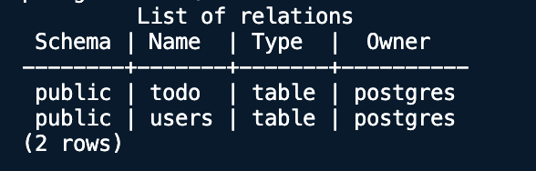
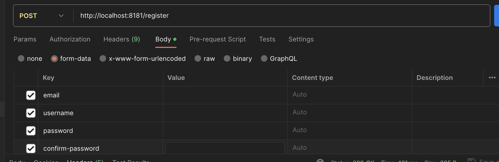
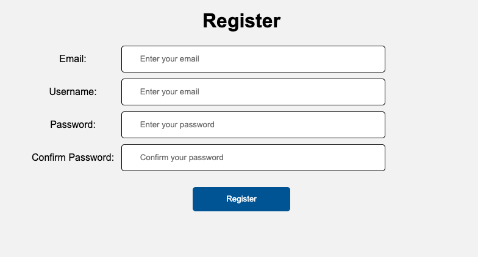
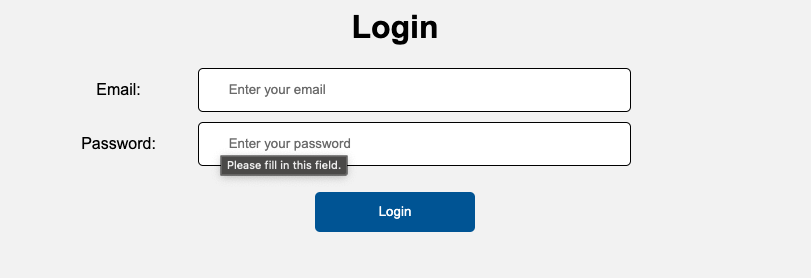
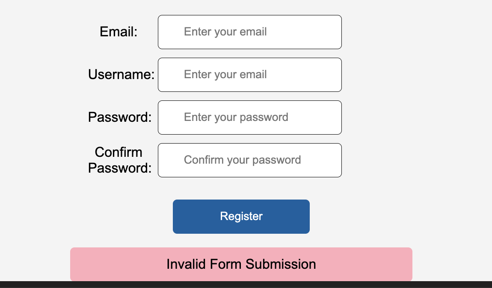
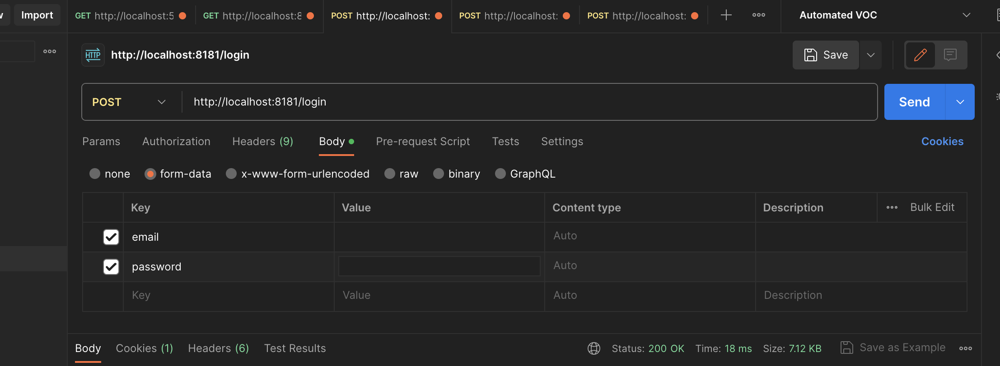
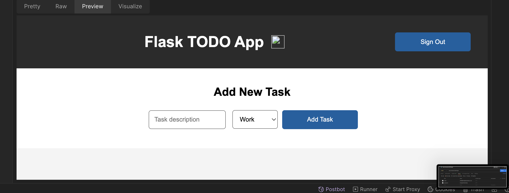
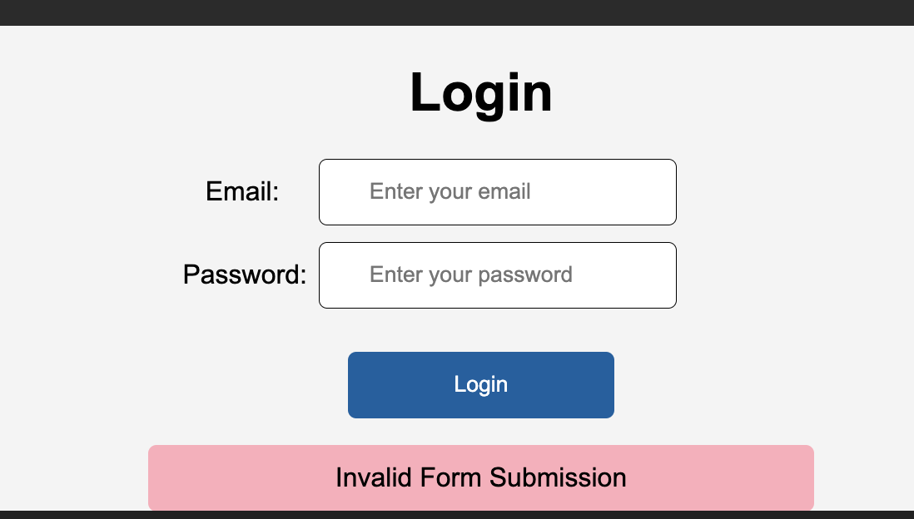

<a name="readme-top"></a>

[![Contributors][contributors-shield]][contributors-url]
[![Forks][forks-shield]][forks-url]
[![Stargazers][stars-shield]][stars-url]
[![Issues][issues-shield]][issues-url]
[![MIT License][license-shield]][license-url]
[![LinkedIn][linkedin-shield]][linkedin-url]

<!-- PROJECT LOGO -->
<br />
<div align="center">
  <a href="https://github.com/dfunani/flask--todo-app">
    
  </a>

  <h3 align="center">Flask--Todo-App</h3>

  <p align="center">
    An awesome README template to jumpstart your projects!
    <br />
    <a href="https://github.com/dfunani/flask--todo-app"><strong>Explore the docs »</strong></a>
    <br />
    <br />
    <a href="https://github.com/dfunani/flask--todo-app">View Demo</a>
    ·
    <a href="https://github.com/dfunani/flask--todo-app/issues">Report Bug</a>
    ·
    <a href="https://github.com/dfunani/flask--todo-app/issues">Request Feature</a>
  </p>
</div>

<!-- TABLE OF CONTENTS -->
<details>
  <summary>Table of Contents</summary>
  <ol>
    <li>
      <a href="#about-the-project">About The Project</a>
      <ul>
        <li><a href="#built-with">Built With</a></li>
      </ul>
    </li>
    <li>
      <a href="#getting-started">Getting Started</a>
      <ul>
        <li><a href="#prerequisites">Prerequisites</a></li>
        <li><a href="#installation">Installation</a></li>
      </ul>
    </li>
    <li><a href="#usage">Usage</a></li>
    <li><a href="#roadmap">Roadmap</a></li>
    <li><a href="#contributing">Contributing</a></li>
    <li><a href="#license">License</a></li>
    <li><a href="#contact">Contact</a></li>
    <li><a href="#acknowledgments">Acknowledgments</a></li>
  </ol>
</details>

<!-- ABOUT THE PROJECT -->

## About The Project

[![Product Name Screen Shot][product-screenshot]](application/static/assets/Screenshot.png)

### Interview Assignment

Welcome to Retail Capital. This assignment will give you a taste of working at Retail Capital (the tech stack, at least). We’re not imposing
particular time limits on it but it shouldn’t take more than a few hours (please try to complete it under 4 hours - you can use more time at
your own discretion to improve the submission but it doesn’t have to be absolutely perfect - think of it as a demonstration of your abilities
and thinking rather than an exercise in writing bug-free code, but obviously, it should work). Your submission will be assessed, after which
time you may be invited to an interview with some of the dev team.

Overview
Your task is to design 2 applications that make up a to-do web application

What You Need to Do

1. Both applications must be in Flask
2. Both applications must be dockerised
3. The front-end application must render templates in Jinja
4. The database must be PostgreSQL
5. Create a few automated tests just to demonstrate the capacity to write them - you do not need to aim for test coverage here and you can
   add them to either application (or both). Be sure to include at least one unit test and one integration test.
6. Ensure that everything required to install and run your application is outlined in the README

The Details that Matter

1. Proper use of RESTful API’s is important - the data, the processing of data and response are all important
2. Proper error handling is important - this can occur at any stage in the application
3. Code organisation is important - it should be clear to read
4. Be able to talk about what you thought you implemented well and why as well as what you think could be improved and why.

<p align="right">(<a href="#readme-top">back to top</a>)</p>

### Built With

This section should list any major frameworks/libraries used to bootstrap your project. Leave any add-ons/plugins for the acknowledgements section. Here are a few examples.

- [![Python][Python.org]][Python-url]
- [![Flask][Flask.com]][Flask-url]
- [![Postgres][Postgres.com]][Postgres-url]
- [![Docker][Docker.com]][Docker-url]
- [![Jinja][Jinja.com]][Jinja-url]

<p align="right">(<a href="#readme-top">back to top</a>)</p>

<!-- GETTING STARTED -->

## Getting Started

The following outlines the instructions on setting up your project locally.
The instructions include running the frontend app, postgres database and running the full-stack app with Docker.

### Prerequisites

The list of dependencies required to use make use of this repository.

- Docker
  https://docs.docker.com/engine/install/

- Python3
  https://www.python.org/downloads/

### Installation

_Below are the instructions on installing and setting up the app._

1. Clone the Repository

   ```sh
   git clone https://github.com/dfunani/flask--todo-app.git
   ```

2. Create `Environment Variables`

   ```sh
   touch ./application/.env
   ```

3. Update `application/.env`

   ```python
   SECRET_KEY = "secret-key"
   TYPE = "postgresql"
   USERNAME="postgres"
   PASSWORD="postgres"
   HOST="your-private-ip"
   DATABASE="postgresdb"
   ```

4. Update `application/Dockerfile`

   ```Dockerfile
   ENV SECRET_KEY = "secret-key"
   ENV HOST = "your-private-ip"
   ```

<p align="right">(<a href="#readme-top">back to top</a>)</p>

<!-- USAGE EXAMPLES -->

## Usage

The project was designed to run as a combined Application with its own instance of Postgres. So a user may choose to run the Backend Database and the Frontend Application seperately or may run both as one container.

### Database

The project uses a Postgres Database, instantiated using [docker-postgres](https://hub.docker.com/_/postgres), to make the project completely self-contained.

#### Build Database Container - Dockerfile

```sh
docker build -t db database/
```

#### Run Database Container - Dockerfile

```sh
docker run -p 5432:5432 db
```

#### Test Container - PSQL

```sh
psql -h 'your-private-ip' -U postgres
# Enter Password - postgres

# Swicth to the Applications - Postgres DB
\c postgresdb

# View all tables - should result
\dt
```



<p align="right">(<a href="#readme-top">back to top</a>)</p>

### Application

The project makes use Python, Flask and Jinja to create Views and Controllers for the application Frontend, herein called the 'Application'. Please note: a postgres db is required as a dependency. If an independent instance of Postgres is used:

```python
SECRET_KEY = "secret-key"
TYPE = "postgresql"
USERNAME=""
PASSWORD=""
HOST=""
DATABASE=""
```

#### Run Application - flask

```sh
flask --app app.py --debug run -p 8181 --host=0.0.0.0
```

#### Build Application Container - Dockerfile

```sh
docker build -t app application/
```

#### Run Application Container - Dockerfile

```sh
docker run -p 5432:5432 app
```

#### Test Container - Flask

```sh
curl -sSf http://localhost:8181 > /dev/null
```

_If application is working, above command returns NOTHING_

### Combined Project

The project, as outlined before, can be run as one project instantiating the Database and the Application from one docker container.

#### Build Project Container - Dockerfile

```sh
docker-compose up
```

#### Test Container - Flask

- Database

```sh
curl -sSf http://localhost:8181 > /dev/null
```

_If application is working, above command returns NOTHING_

- Application

```sh
psql -h 'your-private-ip' -U postgres
# Enter Password - postgres

# Swicth to the Applications - Postgres DB
\c postgresdb

# View all tables - should result
\dt
```


#### Flask--Todo-App

Postgres powered Python Application, that allows 'Autheticated' users to create or delete tasks. Authentication is simple email-password authentication.

#### User Registration

##### POST /register

1. REQUEST

- Form Data
  

- Registration Form
  

2. RESPONSE

- SUCCESS
  

- ERROR - Invalid Request
  

#### User Authentication

##### GET /login


##### POST /login

1. REQUEST

- Form Data
  

- Login Form
  

2. RESPONSE

- SUCCESS
  

- ERROR - Invalid Request
  

##### Token

To access any of the protected endpoints, view, create and remove todo task, require a _TOKEN_. A server generated token can be retreived:

###### POST /token

1. REQUEST

```json
{
  "email": "delali@thedigitalacademy.co.za",
  "password": "ChelseaFC201221@"
}
```

2. RESPONSE

- SUCCESS

```json
{
  "code": 200,
  "message": "",
  "token": "Token generated"
}
```

- ERROR

```json
{
  "code": 405,
  "message": "Password is wrong",
  "token": null
}
```

#### Sign Out

##### GET /sign-out

- REQUEST

1. Headers

Content-Type: application/json
x-access-token: Server Token

- RESPONSE


#### Create Task

##### POST /todo

- REQUEST

1. Headers

Content-Type: application/json
x-access-token: Server Token

2. Body

```json
{
    "task": "testing task postman",
    "status": "Other" # Accepts 'School Other Work Personal'
}
```

- RESPONSE

```json
{
    "code": 200,
    "message": "",
    "result": [
        {
            "created": "Tue, 10 Oct 2023 19:54:04 GMT",
            "id": 2,
            "status": "Other",
            "task": "testingb task postman"
        }
    ]
}
```

#### Delete Task

##### POST /remove-todo

- REQUEST

1. Headers

Content-Type: application/json
x-access-token: Server Token

2. Body

```json
{
    "id": 1 # todo_id
}
```

- RESPONSE

```json
{
    "code": 200,
    "message": "",
    "result": [
        {
            "created": "Tue, 10 Oct 2023 19:54:04 GMT",
            "id": 2,
            "status": "Other",
            "task": "testingb task postman"
        }
    ]
}
```

#### Get All Tasks for User

##### GET /todos

- REQUEST

1. Headers

Content-Type: application/json
x-access-token: Server Token

- RESPONSE

```json
{
    "code": 200,
    "message": "",
    "result": [
        {
            "created": "Tue, 10 Oct 2023 19:54:04 GMT",
            "id": 2,
            "status": "Other",
            "task": "testingb task postman"
        }
    ]
}
```

<p align="right">(<a href="#readme-top">back to top</a>)</p>

<!-- CONTACT -->

## Contact

[Delali Funani](https://github.com/dfunani) - dfunani@gmail.com

Project Link: [https://github.com/dfunani/flask--todo-app](https://github.com/dfunani/flask--todo-app)

<p align="right">(<a href="#readme-top">back to top</a>)</p>

<!-- MARKDOWN LINKS & IMAGES -->
<!-- https://www.markdownguide.org/basic-syntax/#reference-style-links -->

[contributors-shield]: https://img.shields.io/github/contributors/othneildrew/Best-README-Template.svg?style=for-the-badge
[contributors-url]: https://github.com/dfunani/flask--todo-app/graphs/contributors
[forks-shield]: https://img.shields.io/github/forks/othneildrew/Best-README-Template.svg?style=for-the-badge
[forks-url]: https://github.com/dfunani/flask--todo-app/network/members
[stars-shield]: https://img.shields.io/github/stars/othneildrew/Best-README-Template.svg?style=for-the-badge
[stars-url]: https://github.com/dfunani/flask--todo-app/stargazers
[issues-shield]: https://img.shields.io/github/issues/othneildrew/Best-README-Template.svg?style=for-the-badge
[issues-url]: https://github.com/dfunani/flask--todo-app/issues
[license-shield]: https://img.shields.io/github/license/othneildrew/Best-README-Template.svg?style=for-the-badge
[license-url]: https://github.com/dfunani/flask--todo-app/blob/master/LICENSE.txt
[linkedin-shield]: https://img.shields.io/badge/-LinkedIn-black.svg?style=for-the-badge&logo=linkedin&colorB=555
[linkedin-url]: https://linkedin.com/in/othneildrew
[product-screenshot]: application/static/assets/Screenshot.png
[Python.org]: https://img.shields.io/badge/python-3670A0?style=for-the-badge&logo=python&logoColor=ffdd54
[Python-url]: https://www.python.org/
[Flask.com]: https://img.shields.io/badge/flask-%23000.svg?style=for-the-badge&logo=flask&logoColor=white
[Flask-url]: https://flask.palletsprojects.com/en/3.0.x/
[Postgres.com]: https://img.shields.io/badge/postgres-%23316192.svg?style=for-the-badge&logo=postgresql&logoColor=white
[Postgres-url]: https://www.postgresql.org/
[Docker.com]: https://img.shields.io/badge/docker-%230db7ed.svg?style=for-the-badge&logo=docker&logoColor=white
[Docker-url]: https://www.docker.com/
[Jinja.com]: https://img.shields.io/badge/jinja-white.svg?style=for-the-badge&logo=jinja&logoColor=black
[Jinja-url]: https://jinja.palletsprojects.com/en/3.1.x/
